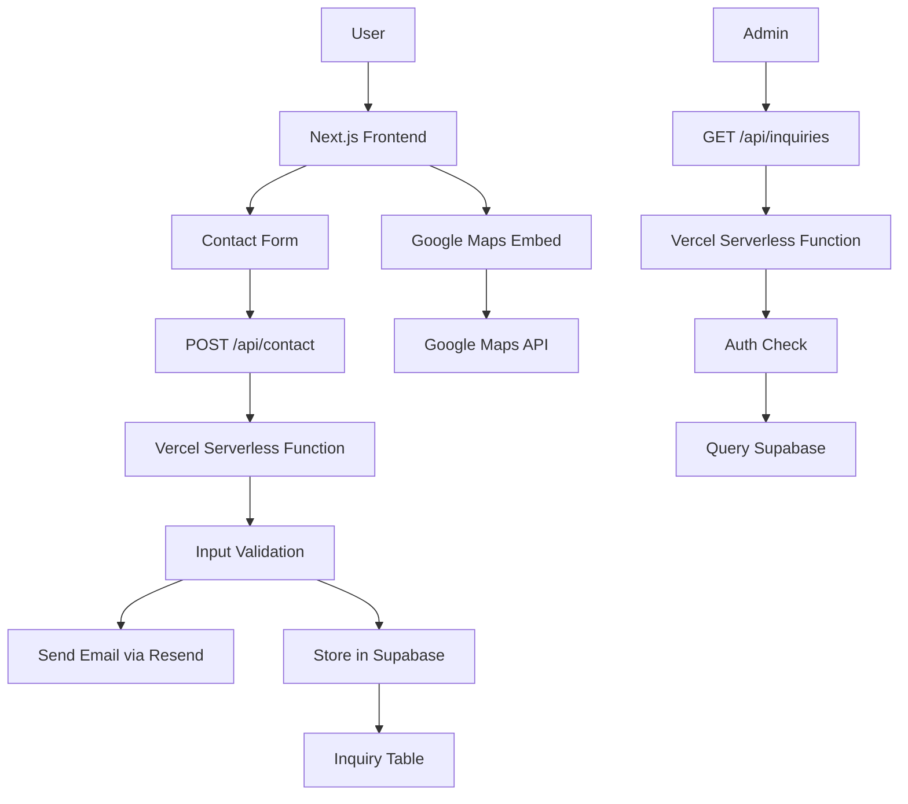

# Backend Architecture Design for Royal Sand Website

## Overview
The Royal Sand website is a Next.js application deployed on Vercel, serving as a business/portfolio site for a construction materials supplier. This backend architecture design focuses on handling contact form submissions via email, optional data storage for inquiries, and integration with Google Maps. The design emphasizes scalability, cost-effectiveness, and serverless technologies to complement the existing Next.js/Vercel setup.

## Technology Stack
- **Frontend**: Next.js (existing)
- **Hosting**: Vercel (existing, with serverless functions)
- **Database**: Supabase (already configured via .env.local)
- **Email Service**: Resend (cost-effective, serverless email API)
- **Maps Integration**: Google Maps API (for frontend embedding and optional geocoding)
- **Backend Logic**: Vercel Serverless Functions (via Next.js API routes)
- **Validation**: Joi or Yup for input validation
- **Security**: Built-in Vercel HTTPS, CORS, rate limiting

## API Endpoints
- **POST /api/contact**
  - Purpose: Handle contact form submissions
  - Input: JSON with name, email, phone (optional), message
  - Actions: Validate input, send email notification, optionally store in Supabase
  - Response: Success confirmation or error details
- **GET /api/inquiries** (optional, for admin panel)
  - Purpose: Retrieve stored inquiries for management
  - Authentication: Required (e.g., API key or Supabase auth)
  - Response: List of inquiries with pagination

## Data Models
### Inquiry
- **id**: UUID (primary key, auto-generated by Supabase)
- **name**: String (required, max 100 chars)
- **email**: String (required, valid email format)
- **phone**: String (optional, validated phone format)
- **message**: String (required, max 1000 chars)
- **created_at**: Timestamp (auto-generated)
- **status**: Enum (pending, responded, archived) - optional for tracking

## Security Measures
- **Input Validation**: Server-side validation using Joi/Yup on all API inputs
- **Rate Limiting**: Implement via Vercel Edge Functions or middleware (e.g., 10 requests per minute per IP)
- **CORS**: Configure to allow only the website domain
- **Authentication**: For admin endpoints, use Supabase auth or API keys
- **Data Encryption**: Supabase handles encryption at rest; use HTTPS for transit
- **reCAPTCHA**: Optional integration for contact forms to prevent spam
- **Environment Variables**: Store all secrets (API keys, DB credentials) in Vercel env vars
- **Logging**: Use Vercel logs and Supabase audit logs for monitoring

## Deployment Strategy
- **Serverless Functions**: Implement APIs as Next.js API routes (/pages/api or /app/api)
- **Database**: Use Supabase for serverless PostgreSQL storage
- **Email**: Integrate Resend API in serverless functions for email sending
- **Scaling**: Vercel automatically scales serverless functions; Supabase scales with usage
- **CI/CD**: Use Vercel deployments from GitHub/GitLab
- **Monitoring**: Leverage Vercel Analytics and Supabase dashboard
- **Cost Optimization**: Pay-per-use model for all services; monitor usage to stay within free tiers initially

## Architecture Diagram

## Integration Notes
- **Contact Forms**: Forms submit to /api/contact; on success, show confirmation; on failure, display errors
- **Google Maps**: Use Google Maps JavaScript API for embedding maps on location pages; no backend processing unless geocoding is needed
- **Data Storage**: Optional; if enabled, inquiries are stored for follow-up; otherwise, only email notifications
- **Scalability**: All components are serverless and scale automatically with Vercel/Supabase
- **Cost**: Low-cost due to serverless nature; Resend has generous free tier

This architecture provides a robust, scalable backend while keeping costs low and leveraging the existing Next.js/Vercel setup.